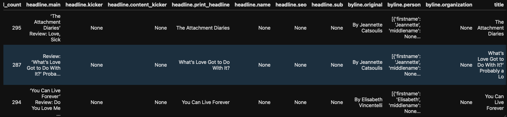
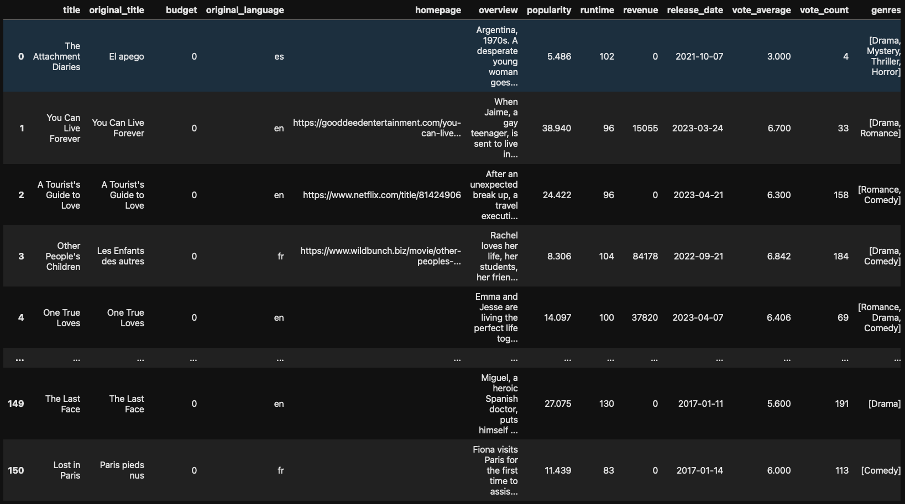
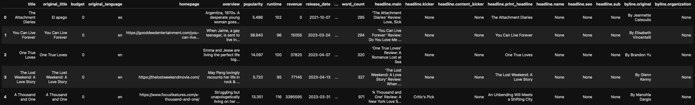

# Data Sourcing Challenge

## This will prepare some data for a recommendation system to help people find movie reviews and related movies. 
## It will extract data from two different sources: The New York Times API and The Movie Database, then merge the data together.

### NY Times data extract sample - 

### Movie Database data extract sample - 

### Merged data sample - 

## Extracted file will then be written to file folder /Output

